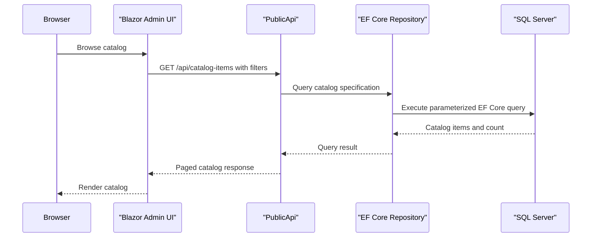

# API & Service Communication Contracts

The repository exposes a catalog and authentication API with eight identified routes, alongside server-rendered Web functionality. PublicApi uses synchronous HTTP/JSON requests and EF Core-backed repositories; no message broker or API gateway aggregation was identified.

## Service Catalog

| Service | Port | Category | Purpose |
|---|---|---|---|
| Web | Local profiles use HTTPS 5001; Docker profile is configured for container use | API/UI | Storefront, account, basket, and order experience |
| PublicApi | Local HTTPS 5099 / HTTP 5098 | API Layer | Catalog reads/writes and username/password authentication |
| BlazorAdmin | Local HTTPS 5001; client module | UI | Browser administration interface that calls PublicApi |
| Infrastructure / ApplicationCore | In-process libraries; no port | Business / Infrastructure | Shared use cases, domain, EF Core, and repository implementations |
| SQL Server | Docker Compose exposes 1433 | Infrastructure | Catalog and identity persistence |

## API Endpoints Inventory

| Service | Method | Path | Request Type | Response Type |
|---|---|---|---|---|
| PublicApi | POST | `/api/authenticate` | `AuthenticateRequest` body | `AuthenticateResponse` |
| PublicApi | GET | `/api/catalog-items` | Optional `pageSize`, `pageIndex`, `catalogBrandId`, `catalogTypeId` query values | `ListPagedCatalogItemResponse` |
| PublicApi | GET | `/api/catalog-items/{catalogItemId}` | `catalogItemId` path value | `GetByIdCatalogItemResponse` |
| PublicApi | POST | `/api/catalog-items` | `CreateCatalogItemRequest` body | `CreateCatalogItemResponse` |
| PublicApi | PUT | `/api/catalog-items` | `UpdateCatalogItemRequest` body | `UpdateCatalogItemResponse` |
| PublicApi | DELETE | `/api/catalog-items/{catalogItemId}` | `catalogItemId` path value | `DeleteCatalogItemResponse` |
| PublicApi | GET | `/api/catalog-brands` | None | `ListCatalogBrandsResponse` |
| PublicApi | GET | `/api/catalog-types` | None | `ListCatalogTypesResponse` |

The catalog write routes require an administrator JWT role. Catalog list/get routes and the authentication route do not require an authenticated caller. Routes are not URL-versioned; Swagger exposes an OpenAPI document identified as `v1`.

## Management & Observability Endpoints

| Service | Endpoint | Custom Metrics |
|---|---|---|
| PublicApi | `/swagger` and `/swagger/v1/swagger.json` | None identified |
| Web | `/health`, `/home_page_health_check`, `/api_health_check` | Health checks only; no custom metrics identified |

## DTOs & Contracts

`AuthenticateRequest` and `AuthenticateResponse` form the login contract; a successful response includes a JWT and account-state fields. Catalog endpoints use request/response wrappers and `CatalogItemDto`, `CatalogBrandDto`, and `CatalogTypeDto`. These are service-level API DTOs; no gateway-level cross-service aggregation DTO was identified. Most DTOs are mutable classes; a small `CatalogItemDetails` record struct is immutable. PublicApi configures Swagger generation and uses the default ASP.NET Core JSON serialization path. No protobuf or GraphQL schema was found.

## Communication Patterns

Browser requests to Web are handled in-process by the Web application. BlazorAdmin uses `HttpClient` with configured base URLs to call PublicApi over synchronous HTTP/JSON. PublicApi handlers call ApplicationCore repository abstractions, which are implemented by EF Core in Infrastructure. Web and PublicApi share the same application and infrastructure libraries; they are not independent domain microservices, and no cross-service response composition was found.

No retry, circuit breaker, bulkhead, or explicit API timeout policy was identified. Authentication uses ASP.NET Core Identity for credentials, cookie authentication for Web, and JWT bearer tokens for PublicApi; catalog mutation routes additionally enforce an administrator role. Both applications configure HTTPS redirection, while local/container service URLs include HTTP profiles. PublicApi has CORS restricted to the configured Web origin, with methods and headers allowed broadly for that origin.

## Service Technology Matrix

| Service | Web | Data Access | Discovery | Gateway | Health | Cache | Metrics |
|---|---|---|---|---|---|---|---|
| Web | MVC, Razor Pages | EF Core through repositories | None | None | ASP.NET Core health checks | IMemoryCache | None identified |
| PublicApi | Minimal API and API Endpoints | EF Core through repositories | None | None | Health checks not identified | Memory cache registered | None identified |
| BlazorAdmin | Blazor WebAssembly | PublicApi over HttpClient | Configured base URL | None | None identified | Browser local storage | None identified |

## Service Communication Sequence

