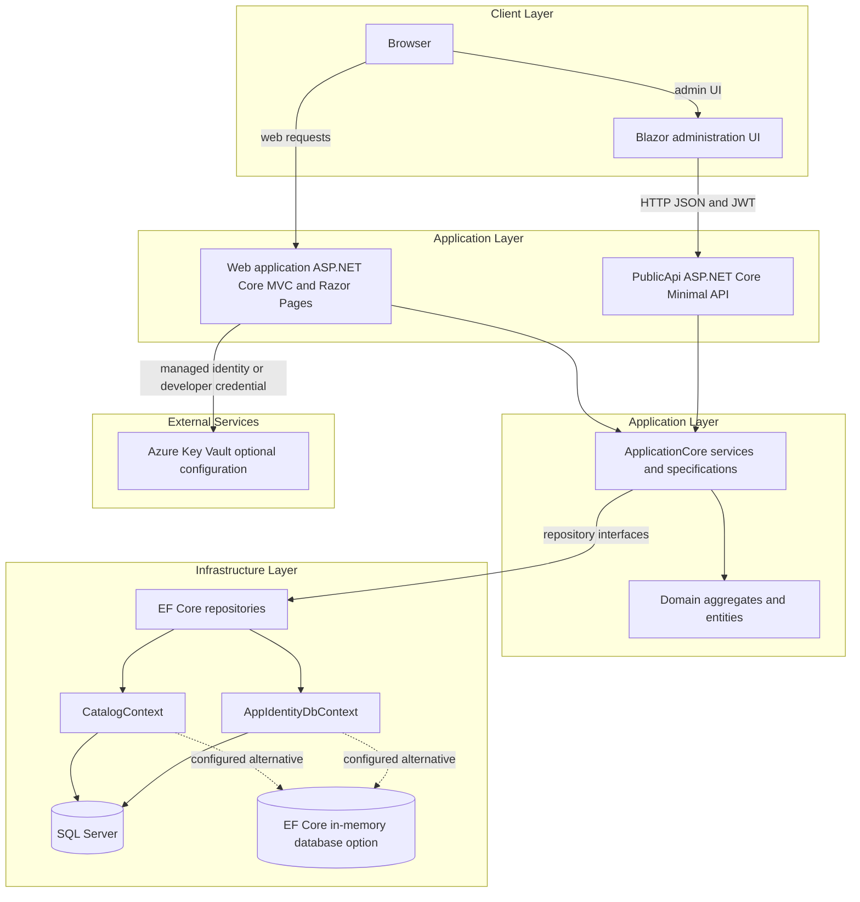
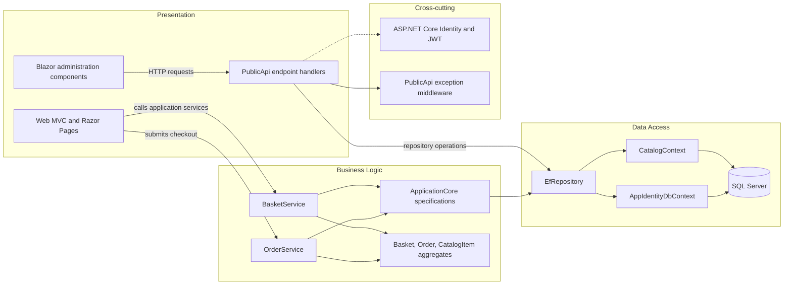

# Architecture Diagram

eShopOnWeb is a layered .NET sample application with a browser-facing web application, a separate catalog/authentication API, shared application logic, and SQL-backed persistence. The Blazor administration UI calls the API over HTTP; the Web and PublicApi applications use the shared core and infrastructure in-process.

## Application Architecture

### Technology Stack Summary

| Layer | Technology | Version | Purpose |
|---|---|---:|---|
| Presentation | ASP.NET Core MVC, Razor Pages | .NET 8 / ASP.NET Core 8.0.2 | Storefront, account, basket, and order screens |
| Presentation | Blazor WebAssembly | .NET 8 / ASP.NET Core 8.0.2 | Administration UI |
| API | ASP.NET Core Minimal API and API Endpoints | .NET 8 | Catalog and authentication endpoints |
| Application | C# application services, Ardalis Specification, MediatR | Package versions centrally managed | Use cases, request handling, and query specifications |
| Persistence | Entity Framework Core with SQL Server provider | EF Core 8.0.2 | Relational persistence and migrations |
| Identity | ASP.NET Core Identity and JWT bearer | ASP.NET Core 8.0.2 | User accounts, cookies, API tokens, and roles |
| Configuration | .NET configuration providers and Azure Key Vault integration | Azure.Identity 1.10.4 | Externalized configuration and production secret retrieval |

### Data Storage & External Services

Catalog and identity data are stored through separate EF Core contexts and independently configured connection strings; SQL Server is the normal relational store, with an EF Core in-memory option for development/testing. The applications also use in-process memory caching and browser local storage. Web can load selected settings from Azure Key Vault; no message broker or external catalog service was identified.

### Key Architectural Decisions

- ApplicationCore owns domain logic and repository interfaces; Infrastructure supplies EF Core repositories and context implementations.
- Catalog and identity persistence are separate contexts; Web and PublicApi share the same infrastructure rather than owning separate databases.
- The Blazor administration UI is a client module that communicates with PublicApi; Docker Compose builds Web and PublicApi as application services.

## Component Relationships

### Component Inventory

| Component | Layer | Type | Responsibility |
|---|---|---|---|
| Web pages and controllers | Presentation | MVC/Razor Pages | Render storefront, account, basket, and order views |
| PublicApi endpoint handlers | Presentation/API | Minimal API and API Endpoint handlers | Expose catalog operations and authentication |
| Blazor administration UI | Presentation | Blazor WebAssembly components | Manage catalog data through PublicApi |
| BasketService | Business Logic | Application service | Add, update, transfer, and delete baskets |
| OrderService | Business Logic | Application service | Create an order from a basket and shipping address |
| Catalog specifications | Business Logic | Query specifications | Express catalog, basket, and order query criteria |
| EfRepository | Data Access | Generic EF Core repository | Execute specifications and CRUD operations |
| CatalogContext | Data Access | EF Core DbContext | Persist catalog, basket, and order entities |
| AppIdentityDbContext | Data Access | Identity DbContext | Persist users, roles, and identity records |
| ExceptionMiddleware | Cross-cutting | ASP.NET Core middleware | Map API exceptions to HTTP responses |
| Identity and JWT handlers | Cross-cutting | Authentication/authorization | Authenticate users and enforce administrative role checks |
