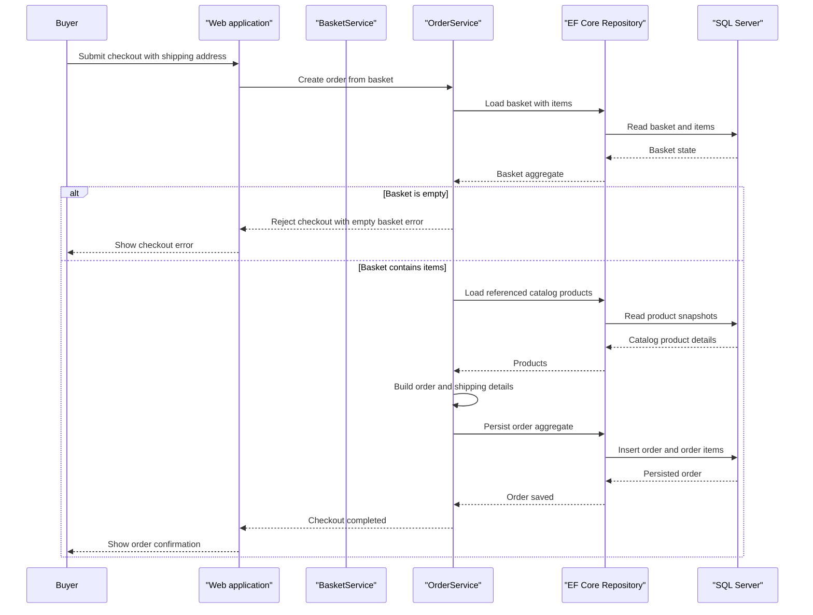

# Core Business Workflows

eShopOnWeb supports browsing a retail catalog, maintaining a customer basket, placing orders, and administering catalog content. The principal workflow is checkout, which converts the buyer's basket into a persisted order with a shipping address and item snapshots.

## Domain Entities

| Entity | Service / Bounded Context | Description | Key Relationships |
|---|---|---|---|
| CatalogItem | Catalog Management | Product that can be browsed and purchased | Classified by CatalogBrand and CatalogType; referenced by basket items |
| CatalogBrand | Catalog Management | Brand classification for products | One brand classifies many catalog items |
| CatalogType | Catalog Management | Type/category classification for products | One type classifies many catalog items |
| Basket | Shopping Basket | A buyer's current selection | Owns BasketItems and is associated with a buyer identity |
| BasketItem | Shopping Basket | Selected product, quantity, and unit price | Belongs to a Basket; references catalog product identity |
| Order | Order Management | Confirmed purchase for a buyer | Owns OrderItems and a shipping address |
| OrderItem | Order Management | Purchased quantity and price | Belongs to an Order and retains an ordered-product snapshot |
| ApplicationUser | Identity | Storefront/admin user account | Provides identity and role information to basket and order flows |

## Service-to-Domain Mapping

| Service | Domain Context | Owned Entities | External Dependencies |
|---|---|---|---|
| Web | Storefront, basket, account, order | Orchestrates catalog, basket, and order use cases | ApplicationCore, Infrastructure, Identity |
| PublicApi | Catalog and authentication | Catalog endpoints; delegates persistence to repositories | ApplicationCore, Infrastructure, Identity |
| BlazorAdmin | Catalog administration UI | No persisted domain ownership; uses API DTOs | PublicApi over HTTP |
| ApplicationCore | Catalog, basket, order | Domain aggregates and business services | Repository interfaces |
| Infrastructure | Persistence and identity | EF Core mappings and context implementations | SQL Server or EF Core InMemory |

The repository is a layered application rather than a microservice set. Web and PublicApi share the same infrastructure/data store; there are no cross-service data joins or event-based domain exchanges.

## Primary Workflows

### Workflow 1: Browse and Filter Catalog

1. A visitor opens the catalog page or the Blazor administration list.
2. Web calls its catalog view-model service, or BlazorAdmin calls PublicApi's paged catalog endpoint.
3. The application builds brand/type filtering and pagination specifications.
4. The generic repository executes the query against the catalog context.
5. Catalog results and image URIs are mapped to view/API DTOs and returned to the client.

### Workflow 2: Place an Order

1. A buyer adds catalog items to the basket; the basket aggregate merges duplicate item selections and tracks quantities.
2. At checkout, the application loads the basket with items and rejects an empty basket through the checkout guard.
3. The order service resolves the catalog items to snapshot product identity and image information.
4. It creates order items using the basket quantities and prices, attaches the shipping address, and persists the order aggregate.
5. The buyer's order history and details are later retrieved through buyer-scoped specifications.

### Workflow 3: Administer Catalog

1. An administrator authenticates through the PublicApi authentication route and receives a bearer token.
2. BlazorAdmin sends catalog create/update/delete requests with the token.
3. PublicApi applies the administrator role requirement on mutation routes, checks for duplicate catalog names on creation, and uses the generic repository to persist changes.
4. Catalog images are not uploaded through the create endpoint; the sample uses a placeholder image URI.

## Cross-Service Data Flows

BlazorAdmin calls PublicApi for catalog data and management; the API returns catalog DTOs built from shared repository-backed entities. PublicApi does not aggregate data from other services, and no circuit-breaker fallback behavior was identified. Web storefront workflows use the shared application services and infrastructure in-process rather than calling a separate order service. If PublicApi is unavailable, the administration UI cannot complete API-backed catalog actions; no offline write queue was found.

## Business Workflow Sequence

## Business Rules & Decision Logic

- Catalog items require a non-empty name and description and a positive price when updated; brand and type identifiers cannot be zero.
- A catalog item with a duplicate name is rejected by the create endpoint.
- Basket additions merge quantities when the same product is already present; zero-quantity basket items are removed during quantity updates.
- Checkout requires a non-empty basket. The order snapshots purchased product details and uses basket unit prices and quantities.
- Catalog mutations require the administrator role; buyer order queries are scoped to the authenticated buyer.
- Basket transfer merges an anonymous basket into the signed-in buyer's basket and then deletes the anonymous basket.
- Data access uses EF Core repository operations. No distributed transaction/saga or asynchronous event choreography was identified.
