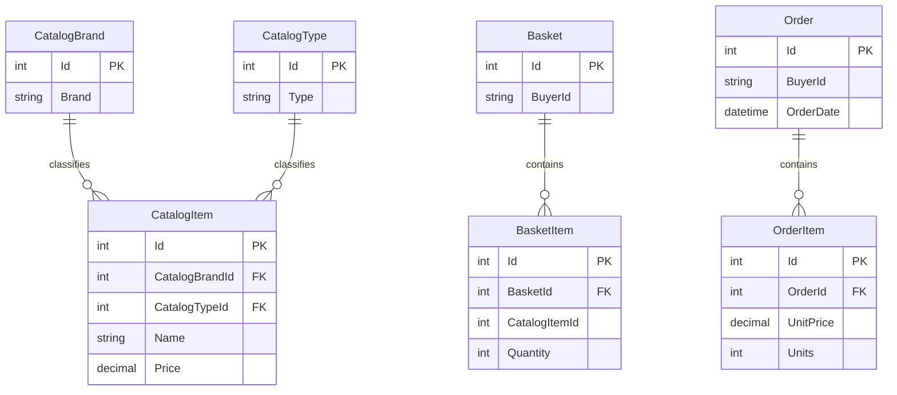

# Data Architecture & Persistence Layer

The data layer uses EF Core over SQL Server by default, with an in-memory provider option. Catalog, basket, and order aggregates are persisted through a generic repository/specification pattern; ASP.NET Identity has a separate context.

## Database Configuration

| Service/Module | DB Type | Profile | Driver | Connection | Migration Tool |
|---|---|---|---|---|---|
| Web / PublicApi catalog | SQL Server | Normal/local and Docker | EF Core SQL Server 8.0.2 | `ConnectionStrings:CatalogConnection` (sensitive values omitted) | EF Core migrations |
| Web / PublicApi identity | SQL Server | Normal/local and Docker | EF Core SQL Server 8.0.2 | `ConnectionStrings:IdentityConnection` (sensitive values omitted) | EF Core migrations / ASP.NET Identity |
| Web / PublicApi catalog and identity | EF Core InMemory | When `UseOnlyInMemoryDatabase` is enabled | EF Core InMemory 8.0.2 | Named in-memory stores | No schema migration |

SQL Server is the normal store; initial data is seeded at application startup. Identity seeding applies migrations when SQL Server is used. No Flyway or Liquibase configuration was found.

## Data Ownership per Service

| Service | Tables Owned | ORM Framework | Caching | Notes |
|---|---|---|---|---|
| Catalog and commerce (`CatalogContext`) | CatalogItems, CatalogBrands, CatalogTypes, Baskets, BasketItems, Orders, OrderItems | EF Core | Web memory cache; no database second-level cache identified | Context and mappings live in Infrastructure |
| Identity (`AppIdentityDbContext`) | Users, roles, claims, logins, tokens, and related Identity records | EF Core Identity | In-process revocation cache used by Web | Separate context and connection setting |

## Entity Model

`CatalogItem` relates to one brand and one type. Basket and order aggregates own their respective item collections; order items preserve an owned `CatalogItemOrdered` snapshot, and orders own the shipping-address value object. The model also includes Buyer and PaymentMethod types; no payment-card persistence path was identified. Entity sources include `src/ApplicationCore/Entities/` and EF mappings in `src/Infrastructure/Data/Config/`. EF Core handles transaction boundaries for repository operations; explicit distributed transactions were not found.

## Key Repository Methods

| Service | Repository | Notable Methods | Purpose |
|---|---|---|---|
| Catalog, basket, and order | `EfRepository<T>` (`src/Infrastructure/Data/EfRepository.cs`) | Inherited `ListAsync`, `FirstOrDefaultAsync`, `CountAsync`, `AddAsync`, `UpdateAsync`, `DeleteAsync` | Generic EF Core persistence with Ardalis specifications |
| Catalog | `CatalogFilterSpecification`, `CatalogFilterPaginatedSpecification` | Filter by brand/type; skip/take pagination | Catalog browse and filtering |
| Catalog | `CatalogItemNameSpecification`, `CatalogItemsSpecification` | Match name; retrieve a set of catalog IDs | Duplicate-name check and basket/order catalog lookups |
| Basket | `BasketWithItemsSpecification` | Retrieve basket by buyer or ID with items | Basket service operations |
| Orders | `OrderWithItemsByIdSpec`, customer order specifications | Retrieve order details and buyer order lists | Web order history and details |

No custom SQL or stored procedure calls were identified.

## Caching Strategy

Web registers `IMemoryCache` for catalog view data and identity token-revocation markers; the revocation cache is process-local and source comments note that a distributed cache is needed for multi-host deployments. BlazorAdmin decorators use browser local storage for catalog and lookup caching. A 30-second duration is configured for Web catalog caching. No Redis, distributed cache provider, or EF second-level cache was identified.

## Data Ownership Boundaries

Web and PublicApi share the same data model and infrastructure; both access the same catalog and identity data through separately configured contexts. Contexts and connection strings distinguish catalog from identity, but no database-per-microservice boundary exists. Application services access persistence through repository interfaces; endpoint/UI paths do not issue custom SQL. Catalog IDs are stored in basket items and order item snapshots to support commerce flows; no cross-service REST-based data join or CQRS read model was identified.

### Data Classification & Sensitivity

| Entity | Sensitive Fields | Classification (PII/PHI/PCI/None) | Controls in Place |
|---|---|---|---|
| Identity user | Username, email, phone number; Identity credentials are stored through ASP.NET Identity | PII / credentials | Identity password hashing; no field-level encryption identified |
| Order / Address | Buyer identifier and shipping address fields | PII | No field-level encryption or masking identified; database encryption depends on deployment configuration |
| Catalog, Basket, BasketItem | Product metadata, buyer identifier, product and quantity references | PII (buyer identifier); otherwise non-sensitive | No field-level encryption or masking identified |
| PaymentMethod | No persisted card number or payment credential fields identified in the scanned model | None detected | Not applicable |
