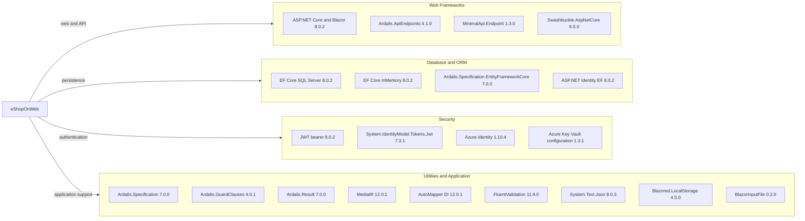

# Dependency Map

eShopOnWeb centrally manages 50 NuGet package declarations in `Directory.Packages.props`, including application, build, and test dependencies. Framework-provided assemblies are not counted as separate NuGet declarations.

## Dependencies

### Dependency Summary

| Category | Count | Key Libraries | Notes |
|---|---:|---|---|
| Web frameworks and API | 19 | ASP.NET Core/Blazor, Ardalis.ApiEndpoints, MinimalApi.Endpoint, Swashbuckle | Includes web scaffolding, API, and UI/build packages |
| Database / ORM and identity persistence | 5 | EF Core SQL Server/InMemory/Tools, Ardalis.Specification.EntityFrameworkCore, Identity EF | Central versions use shared MSBuild properties |
| Security and cloud configuration | 5 | JWT Bearer, Identity, Azure.Identity, Azure Key Vault configuration | Identity packages overlap with web framework and data categories |
| Application libraries and utilities | 11 | Ardalis Specification/Result/GuardClauses, MediatR, AutoMapper, FluentValidation, System.Text.Json | Domain/use-case and serialization support |
| Test dependencies | 10 | xUnit, MSTest, NSubstitute, MVC testing, coverlet | Excluded from the production dependency diagram |

### Version & Compatibility Risks

The projects target `net8.0`; centrally managed package versions include older components such as `Microsoft.AspNetCore.Mvc` 2.2.0, `System.IdentityModel.Tokens.Jwt` 7.3.1, and `AutoMapper.Extensions.Microsoft.DependencyInjection` 12.0.1. AppCAT reported package compatibility, recommended-upgrade, deprecated-package, and vulnerability findings; the versioned security assessment records dependency advisories separately.

### Notable Observations

- Central Package Management is enabled through `Directory.Packages.props`; framework package versions are factored into MSBuild properties.
- The solution combines xUnit and MSTest packages across its test projects.
- EF Core InMemory is a selectable alternative, not a replacement for the SQL Server provider.
- Several test/build-only packages are included in the central package file and are not runtime dependencies.

## Test Dependencies

| Framework | Version | Notes |
|---|---:|---|
| xUnit | 2.7.0 | Unit and functional testing |
| xunit.runner.visualstudio | 2.5.6 | Test discovery and execution |
| xunit.runner.console | 2.7.0 | Console runner |
| MSTest | 3.2.2 | Adapter and framework are centrally declared |
| Microsoft.NET.Test.Sdk | 17.9.0 | .NET test host |
| Microsoft.AspNetCore.Mvc.Testing | 8.0.2 | In-memory ASP.NET Core integration test host |
| NSubstitute | 5.1.0 | Test doubles |
| NSubstitute.Analyzers.CSharp | 1.0.17 | Substitute diagnostics |
| coverlet.collector | 6.0.2 | Coverage collection |

Total test-scope dependencies: 10

The repository has unit, functional, integration, and PublicApi integration test projects. Both xUnit and MSTest are present, so test conventions are not uniform across all projects.
