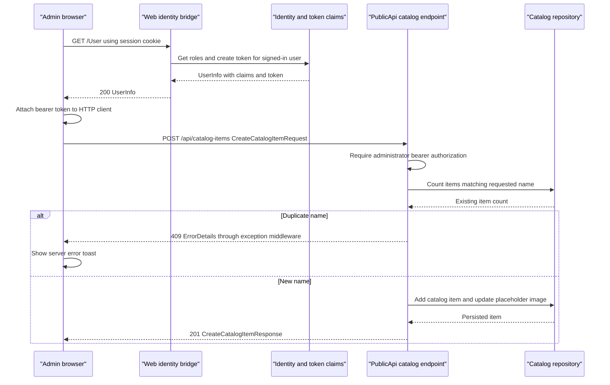

# API & Service Communication Contracts

PublicApi declares eight application HTTP operations (seven catalog operations and authentication), and Web supplies a two-operation JSON user/token bridge plus MVC and Razor Pages (`src/PublicApi/*Endpoints/*Endpoint.cs`, `src/Web/Controllers/UserController.cs:35-57`). Communication is request/response HTTP and in-process calls; the larger Web surface is grouped below rather than treated as a second business-service API.

## Service Catalog

| Service | Port | Category | Purpose |
|---|---|---|---|
| Web / src/Web | Project HTTPS 5001 / HTTP 5000; IIS Express 44315 / 17469; Docker host 5106 to container 8080 | API Layer / presentation | Storefront, Identity UI, user/token bridge and hosted admin client; SDK Web, MediatR, Identity (`src/Web/Properties/launchSettings.json:5-8,20-36`, `docker-compose.override.yml:3-11`, `src/Web/Web.csproj:1,21,23,28-29`) |
| PublicApi / src/PublicApi | Project HTTPS 5099 / HTTP 5098; IIS Express 44339 / 52023; Docker host 5200 to container 8080 | API Layer | Catalog CRUD/lookups and sign-in; MinimalApi.Endpoint, Ardalis.ApiEndpoints, Swashbuckle (`src/PublicApi/Properties/launchSettings.json:11-18,39-45`, `docker-compose.override.yml:12-20`, `src/PublicApi/PublicApi.csproj:12-18`) |
| BlazorAdmin / src/BlazorAdmin | Browser client hosted by Web; standalone dev profile 5001 / 5000 | API Layer / client | Administration UI; no separate production server declared in Compose; WebAssembly SDK (`src/BlazorAdmin/BlazorAdmin.csproj:1-11`, `src/BlazorAdmin/Properties/launchSettings.json:20-27`, `src/Web/Program.cs:184-199`) |
| sqlserver | 1433 host/container | Infrastructure, third-party container | Shared SQL engine, not a source-built application (`docker-compose.yml:18-24`) |
| ApplicationCore, Infrastructure, BlazorShared | No listening ports | Business / infrastructure libraries | Shared domain, persistence and client contracts; not independently deployable services (`src/ApplicationCore/ApplicationCore.csproj:1-17`, `src/Infrastructure/Infrastructure.csproj:1-16`, `src/BlazorShared/BlazorShared.csproj:1-10`) |

Azure deployment manifests declare only the Web App Service, not an independently provisioned PublicApi service (`azure.yaml:3-8`, `infra/main.bicep:47-65`). These describe deployment options, not verified running infrastructure.

## API Endpoints Inventory

| Service | Method | Path | Request Type | Response Type |
|---|---|---|---|---|
| PublicApi | POST | /api/authenticate | AuthenticateRequest JSON | AuthenticateResponse, normally 200 with success/lockout/two-factor flags and optional token; failed credentials are represented in body (`src/PublicApi/AuthEndpoints/AuthenticateEndpoint.cs:29-57`) |
| PublicApi | GET | /api/catalog-items | Query pageSize, pageIndex, catalogBrandId, catalogTypeId; ListPagedCatalogItemRequest | 200 ListPagedCatalogItemResponse (`src/PublicApi/CatalogItemEndpoints/CatalogItemListPagedEndpoint.cs:29-71`) |
| PublicApi | GET | /api/catalog-items/{catalogItemId} | Integer path; GetByIdCatalogItemRequest | 200 GetByIdCatalogItemResponse; 404 (`src/PublicApi/CatalogItemEndpoints/CatalogItemGetByIdEndpoint.cs:23-52`) |
| PublicApi | POST | /api/catalog-items | CreateCatalogItemRequest JSON; administrator bearer token | 201 CreateCatalogItemResponse and Location; duplicate name maps to 409 ErrorDetails (`src/PublicApi/CatalogItemEndpoints/CreateCatalogItemEndpoint.cs:27-74`, `src/PublicApi/Middleware/ExceptionMiddleware.cs:35-42`) |
| PublicApi | PUT | /api/catalog-items | UpdateCatalogItemRequest JSON, ID inside body; administrator bearer token | 200 UpdateCatalogItemResponse; 404 (`src/PublicApi/CatalogItemEndpoints/UpdateCatalogItemEndpoint.cs:25-65`) |
| PublicApi | DELETE | /api/catalog-items/{catalogItemId} | Integer path; DeleteCatalogItemRequest; administrator bearer token | 200 DeleteCatalogItemResponse; 404 (`src/PublicApi/CatalogItemEndpoints/DeleteCatalogItemEndpoint.cs:18-40`) |
| PublicApi | GET | /api/catalog-brands | No body | 200 ListCatalogBrandsResponse (`src/PublicApi/CatalogBrandEndpoints/CatalogBrandListEndpoint.cs:25-44`) |
| PublicApi | GET | /api/catalog-types | No body | 200 ListCatalogTypesResponse (`src/PublicApi/CatalogTypeEndpoints/CatalogTypeListEndpoint.cs:25-44`) |
| Web | GET | /User | Cookie identity when available; AllowAnonymous overrides Authorize | 200 BlazorShared.Authorization.UserInfo, anonymous or claims/token (`src/Web/Controllers/UserController.cs:35-39,60-103`) |
| Web | POST | /User/Logout | Cookie/session state; also marked AllowAnonymous | 200 empty result when action completes (`src/Web/Controllers/UserController.cs:41-57`); anonymous robustness not runtime-verified |
| Web | GET | /order/my-orders; /order/detail/{orderId} | Cookie identity; integer orderId for detail | HTML order view models; detail 400 if handler returns null (`src/Web/Controllers/OrderController.cs:11-42`, `src/Web/Program.cs:74-79`) |
| Web ManageController | GET / POST | /manage/my-account, /manage/change-password, /manage/set-password, /manage/enable-authenticator | IndexViewModel, ChangePasswordViewModel, SetPasswordViewModel, EnableAuthenticatorViewModel on POST; cookie identity | HTML views, model errors and redirects (`src/Web/Controllers/ManageController.cs:16-17,46-104,136-231,374-438`) |
| Web ManageController | GET | /manage/external-logins, /manage/link-login-callback, /manage/two-factor-authentication, /manage/disable2fa-warning, /manage/show-recovery-codes, /manage/reset-authenticator-warning, /manage/generate-recovery-codes-warning | Cookie identity; provider callback state where applicable | HTML views/redirects (`src/Web/Controllers/ManageController.cs:233-291,318-352,389-401,440-444,486-500`) |
| Web ManageController | POST | /manage/send-verification-email, /manage/link-login, /manage/remove-login, /manage/disable2fa, /manage/reset-authenticator, /manage/generate-recovery-codes | IndexViewModel; provider string; RemoveLoginViewModel; authenticated cookie; form antiforgery on actions | HTML/redirect/challenge responses (`src/Web/Controllers/ManageController.cs:106-134,252-263,293-316,354-372,446-484`) |
| Web Razor Pages (grouped) | GET / POST | /, /Basket, /Basket/Checkout; /Identity/Account/Login, /Identity/Account/Register, /Identity/Account/Logout; /Admin | Form-bound page models; Basket update uses handler query; checkout/admin authorization | HTML and redirects; checkout invalid ModelState returns 400 (`src/Web/Program.cs:81-84,195`, `src/Web/Pages/Basket/Index.cshtml.cs:28-65`, `src/Web/Pages/Basket/Checkout.cshtml.cs:39-67`, `src/Web/Areas/Identity/Pages/Account/Login.cshtml.cs:51-103`, `src/Web/Pages/Admin/Index.cshtml.cs:1-19`) |

Web's convention-based routes use the slugify transformer (`src/Web/Program.cs:67-79,194`). The table groups the larger MVC/page surface rather than counting it among the eight PublicApi operations. Default framework Identity UI pages can add routes not individually implemented in this repository (`src/Web/Program.cs:55-58`). OpenAPI is named v1, but application paths have no version segment and no explicit header/query versioning was found in the endpoint definitions (`src/PublicApi/Program.cs:89-93`, `src/PublicApi/CatalogItemEndpoints/CatalogItemListPagedEndpoint.cs:31-37`).

## Management & Observability Endpoints

| Service | Endpoint | Custom Metrics (if any) |
|---|---|---|
| Web | /health | Composite status/error JSON; checks API and home-page response content (`src/Web/Program.cs:86-89,151-168`) |
| Web | /home_page_health_check; /api_health_check | Individually tagged checks (`src/Web/Program.cs:196-197`, `src/Web/HealthChecks/ApiHealthCheck.cs:23-32`) |
| Web | /allservices | DI listing enabled only Development/Docker (`src/Web/Program.cs:90-94,169-175`) |
| PublicApi | /swagger; /swagger/v1/swagger.json | OpenAPI/UI registered without environment guard (`src/PublicApi/Program.cs:165-173`) |

No custom metric names or metrics exporter are established by the reviewed registrations; both hosts add console logging (`src/Web/Program.cs:23`, `src/PublicApi/Program.cs:32`). PublicApi has no explicit health-check registration in its entry point (`src/PublicApi/Program.cs:26-179`).

## DTOs & Contracts

- API request classes: AuthenticateRequest, ListPagedCatalogItemRequest, GetByIdCatalogItemRequest, CreateCatalogItemRequest, UpdateCatalogItemRequest and DeleteCatalogItemRequest. Response wrappers are the corresponding Authenticate/GetById/ListPaged/Create/Update/Delete response classes plus ListCatalogBrandsResponse and ListCatalogTypesResponse; they derive from BaseRequest/BaseResponse rather than immutable records (`src/PublicApi/BaseRequest.cs:6-8`, `src/PublicApi/BaseResponse.cs:8-18`, `src/PublicApi/CatalogItemEndpoints/CreateCatalogItemEndpoint.CreateCatalogItemRequest.cs:3-13`, `src/PublicApi/CatalogItemEndpoints/CreateCatalogItemEndpoint.CreateCatalogItemResponse.cs:5-16`).
- CatalogItemDto, CatalogBrandDto and CatalogTypeDto are service-level projection contracts, not gateway composites (`src/PublicApi/MappingProfile.cs:10-18`). Web UserInfo/ClaimValue is an authentication bridge, and BlazorShared.Models contains mutable client models (`src/Web/Controllers/UserController.cs:60-103`, `src/BlazorShared/Models/CatalogItem.cs:9-33`). Field/persistence details are in `data-architecture.md`.
- Request/response correlation is supported by BaseMessage; live propagation was not tested (`src/PublicApi/BaseMessage.cs:5-15`, `src/PublicApi/BaseResponse.cs:10-17`).
- OpenAPI is generated from endpoint metadata and Swagger annotations. Client HTTP uses System.Text.Json with case-insensitive response matching; no host-level custom JSON naming policy is configured in the reviewed entry points (`src/PublicApi/Program.cs:88-123`, `src/BlazorAdmin/Services/HttpService.cs:84-94`). No protobuf/GraphQL contract was found in the examined application source.

## Communication Patterns

Admin performs synchronous request/response REST calls; async/await is nonblocking execution, not evidence of messaging (`src/BlazorAdmin/Services/HttpService.cs:25-81`). Web invokes core services and MediatR handlers in-process (`src/Web/Pages/Basket/Checkout.cshtml.cs:55-58`, `src/Web/Controllers/OrderController.cs:26-35`). There is no gateway aggregation or service registry declared in the reviewed hosts/manifests: configured base URLs select targets directly (`src/BlazorShared/BaseUrlConfiguration.cs:3-8`, `src/BlazorAdmin/Services/HttpService.cs:18-28`).

No application-defined HTTP timeout, retry, circuit breaker, bulkhead or client load-balancer is set in HttpService or the HttpClient registrations; no timeout value should be inferred from framework defaults. GET/DELETE failures return null; POST tries ErrorDetails plus a toast; PUT produces a generic toast. Transport exceptions are not caught by HttpService, while the user-state provider catches exceptions and falls back to anonymous (`src/BlazorAdmin/Services/HttpService.cs:25-81`, `src/BlazorAdmin/CustomAuthStateProvider.cs:54-66`). CatalogItemService composes concurrent item/brand/type responses client-side by matching lookup IDs; this is not a server gateway and has no unavailable-downstream fallback or null-safe composition (`src/BlazorAdmin/Services/CatalogItemService.cs:45-94`). Web production SQL uses EnableRetryOnFailure, which is database resilience, not HTTP retry (`src/Web/Program.cs:33-42`). Catalog listing deliberately waits 1000 ms before querying (`src/PublicApi/CatalogItemEndpoints/CatalogItemListPagedEndpoint.cs:40-54`).

Startup seeding precedes request serving but seed exceptions are logged and do not stop either host; Compose orders both hosts after SQL without readiness conditions (`src/Web/Program.cs:120-139`, `src/PublicApi/Program.cs:129-148`, `docker-compose.yml:9-17`). See `configuration-inventory.md` for startup configuration.

Security presence: Web configures cookie/Identity auth, auth middleware and HTTPS redirection; checkout and order actions require authentication (`src/Web/Program.cs:45-58,81-84,184-191`, `src/Web/Controllers/OrderController.cs:11`). PublicApi write operations require the Administrators role with JWT bearer scheme, while catalog reads/authentication are not decorated with authorization (`src/PublicApi/CatalogItemEndpoints/CreateCatalogItemEndpoint.cs:29-35`, `src/PublicApi/CatalogItemEndpoints/CatalogItemGetByIdEndpoint.cs:25-30`). ****** checks the signing key but disables issuer/audience validation; tokens last seven days (`src/PublicApi/Program.cs:54-69`, `src/Infrastructure/Identity/IdentityTokenClaimService.cs:37-42`). PublicApi explicitly calls UseAuthorization but not UseAuthentication; effective middleware behavior requires runtime verification, not an assumption that authentication is absent (`src/PublicApi/Program.cs:155-176`). Both hosts request HTTPS redirection, but Compose overrides listen on HTTP only; hosted App Service enforces HTTPS/TLS 1.2 (`docker-compose.override.yml:5-6,14-15`, `infra/core/host/appservice.bicep:49,61`). This is contract inventory, not an exploit assessment.

## Service Technology Matrix

| Service | Web | Data Access | Discovery | Gateway | Health | Cache | Metrics |
|---|---|---|---|---|---|---|---|
| Web | MVC/Razor Pages, hosted Blazor | EF catalog + Identity | Configured URLs | User/token bridge, not aggregation gateway | Composite + tagged checks | Cached storefront read models | Console logging; no exporter registered |
| PublicApi | Minimal endpoints + MVC auth | Shared EF contexts | None registered | None | No explicit health registration | MemoryCache registered; endpoint cache use not established | Console logging, Swagger |
| BlazorAdmin | WebAssembly | HTTP client, no DB context | Configured URLs | None | Not server health provider | Browser local storage decorators | Configured client logging |

Matrix evidence: `src/Web/Program.cs:55-112`, `src/PublicApi/Program.cs:28-93`, `src/BlazorAdmin/Program.cs:20-36`, `src/Web/Configuration/ConfigureWebServices.cs:13-17`, `src/BlazorAdmin/Services/CachedCatalogLookupDataServiceDecorator .cs:29-50`.

## Service Communication Sequence

Sequence evidence: `src/Web/Controllers/UserController.cs:60-103`, `src/BlazorAdmin/CustomAuthStateProvider.cs:57-82`, `src/PublicApi/CatalogItemEndpoints/CreateCatalogItemEndpoint.cs:29-74`, `src/PublicApi/Middleware/ExceptionMiddleware.cs:35-42`, `src/BlazorAdmin/Services/HttpService.cs:54-66`. Arrows describe logical calls/responses, not a tested deployment trace.
