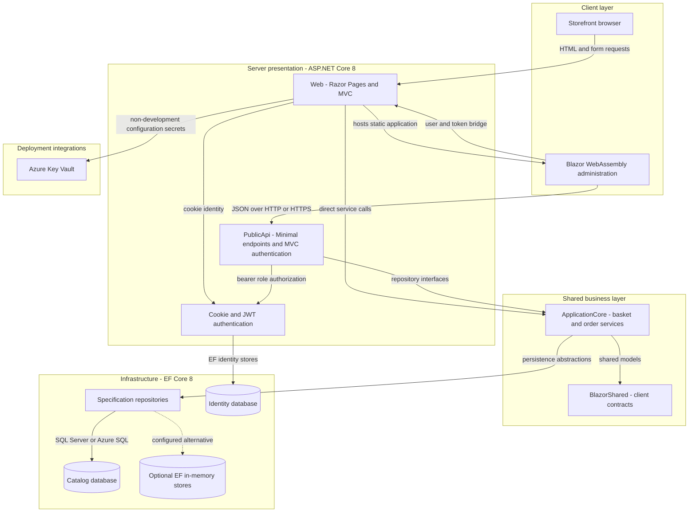

# Architecture Diagram

Repository evidence shows two server entry points and a hosted Blazor administration client sharing application and infrastructure libraries, rather than independently owned business microservices (`src/Web/Web.csproj:43-46`, `src/PublicApi/PublicApi.csproj:35-36`, `src/Web/Program.cs:184-199`). Diagrams aggregate namespaces to keep the component view readable.

## Application Architecture

Evidence: hosting and middleware (`src/Web/Program.cs:45-89,96-112,184-199`); API registrations (`src/PublicApi/Program.cs:28-69,175-176`); client transport and identity bridge (`src/BlazorAdmin/Services/HttpService.cs:18-34`, `src/BlazorAdmin/CustomAuthStateProvider.cs:50-84`); database alternatives (`src/Infrastructure/Dependencies.cs:11-37`); Azure integration (`src/Web/Program.cs:25-43`, `infra/main.bicep:47-105`).

### Technology Stack Summary

| Layer | Technology | Version | Purpose |
|---|---|---|---|
| Runtime/presentation | .NET / ASP.NET Core; Razor Pages, MVC, Blazor WebAssembly | Target net8.0; ASP.NET package baseline 8.0.2 | Server storefront/API and browser admin (`Directory.Packages.props:4-5,25-33`, `src/BlazorAdmin/BlazorAdmin.csproj:1-11`) |
| Business | Ardalis GuardClauses, Result, Specification | 4.0.1, 7.0.0, 7.0.0 | Aggregate rules and repository queries (`Directory.Packages.props:12-15`, `src/ApplicationCore/ApplicationCore.csproj:9-13`) |
| Presentation orchestration | MediatR; AutoMapper DI | 12.0.1; 12.0.1 | Order query handlers and DTO mapping (`Directory.Packages.props:19,24`, `src/Web/Controllers/OrderController.cs:15-35`, `src/PublicApi/Program.cs:85`) |
| Persistence | EF Core SQL Server / InMemory; Identity EF | 8.0.2 | Two contexts and optional volatile storage (`Directory.Packages.props:7,30,39-40`, `src/Infrastructure/Dependencies.cs:19-37`) |
| Contracts/docs | MinimalApi.Endpoint; Ardalis.ApiEndpoints; Swashbuckle | 1.3.0; 4.1.0; 6.5.0 | HTTP endpoints and generated OpenAPI (`Directory.Packages.props:11,46,53-55`, `src/PublicApi/Program.cs:88-123`) |
| Cloud configuration | Azure.Identity; Azure secrets configuration | 1.10.4; 1.3.1 | Key Vault configuration (`Directory.Packages.props:17-18`, `src/Web/Program.cs:31-32`) |
| Caching | IMemoryCache; Blazored.LocalStorage | Framework-provided; 4.5.0 | Storefront and browser catalog caches (`src/Web/Program.cs:65-66`, `Directory.Packages.props:21`) |

### Data Storage & External Services

Web and PublicApi use the same catalog/identity connection targets by default and in Docker; SQL Server LocalDB, a Compose Azure SQL Edge container, and provisioned Azure SQL are distinct deployment options, not concurrently required stores (`src/Web/appsettings.json:6-9`, `src/PublicApi/appsettings.Docker.json:2-5`, `docker-compose.yml:18-24`, `infra/main.bicep:76-105`). The in-memory provider is configurable for tests/development (`src/Infrastructure/Dependencies.cs:13-25`). Azure Key Vault is loaded by Web outside Development/Docker (`src/Web/Program.cs:25-43`); PublicApi does not contain that loader (`src/PublicApi/Program.cs:26-50`). The email adapter is a completed-task stub, not evidence of an operational mail service (`src/Infrastructure/Services/EmailSender.cs:7-15`).

### Key Architectural Decisions

- Business logic depends on aggregate-constrained repository interfaces; Infrastructure implements them through an EF specification repository (`src/ApplicationCore/Interfaces/IRepository.cs:5-7`, `src/Infrastructure/Data/EfRepository.cs:6-11`).
- Shared business/persistence libraries and shared database targets bind the two hosts; project boundaries are not database-per-service boundaries (`src/PublicApi/PublicApi.csproj:35-36`, `src/Web/Web.csproj:43-46`, `src/Infrastructure/Dependencies.cs:32-37`).
- Decorators provide cached read models while aggregates encapsulate item collections (`src/Web/Configuration/ConfigureWebServices.cs:13-17`, `src/ApplicationCore/Entities/OrderAggregate/Order.cs:26-36`).

## Component Relationships

```mermaid
flowchart LR
    subgraph Presentation["Presentation"]
        Pages["Catalog and basket Razor Pages"]
        Orders["OrderController and MediatR handlers"]
        Endpoints["PublicApi catalog endpoints"]
        AdminUI["BlazorAdmin components and HTTP client"]
        User["UserController identity bridge"]
    end
    subgraph Business["Business logic"]
        ViewModels["Catalog and basket view-model services"]
        BasketSvc["BasketService"]
        OrderSvc["OrderService"]
        Aggregates["Catalog, basket and order aggregates"]
        Claims["Token claims service"]
    end
    subgraph DataAccess["Data access"]
        Specs["Specification queries"]
        Repo["EfRepository"]
        Db["CatalogContext"]
        IdDb["AppIdentityDbContext"]
        BasketQuery["BasketQueryService"]
    end
    subgraph Infra["Cross-cutting infrastructure"]
        Auth["Identity and authorization middleware"]
        Errors["API exception middleware"]
        Cache["Read-model cache decorators"]
        Health["Web health checks"]
        Logging["LoggerAdapter"]
    end
    Pages -->|"read models"| ViewModels
    Pages -->|"basket mutations"| BasketSvc
    Pages -->|"checkout"| OrderSvc
    Orders -->|"query"| Specs
    Endpoints -->|"query and CRUD"| Repo
    AdminUI -->|"JSON requests"| Endpoints
    AdminUI -->|"user claims"| User
    User -->|"issue token"| Claims
    Claims -->|"user roles"| IdDb
    ViewModels -->|"query"| Repo
    ViewModels -->|"quantity projection"| BasketQuery
    BasketSvc -->|"mutate"| Aggregates
    OrderSvc -->|"snapshot items"| Aggregates
    BasketSvc -->|"persist"| Repo
    OrderSvc -->|"persist"| Repo
    Specs -->|"evaluated by"| Repo
    Repo -->|"EF operations"| Db
    BasketQuery -->|"LINQ aggregate"| Db
    Auth -.->|"guards"| Presentation
    Errors -.->|"maps exceptions"| Endpoints
    Cache -.->|"wraps"| ViewModels
    Health -.->|"checks responses"| Presentation
    Logging -.->|"business logs"| BasketSvc
```

Evidence: DI (`src/Web/Configuration/ConfigureCoreServices.cs:15-25`, `src/Web/Configuration/ConfigureWebServices.cs:13-17`); order/basket orchestration (`src/ApplicationCore/Services/OrderService.cs:19-51`, `src/ApplicationCore/Services/BasketService.cs:16-37`); mediator (`src/Web/Controllers/OrderController.cs:22-42`); middleware (`src/PublicApi/Program.cs:155-176`); health checks (`src/Web/Program.cs:86-89`).

### Component Inventory

| Component | Layer | Type | Responsibility |
|---|---|---|---|
| Web.Pages | Presentation | Razor Page models | Browse, basket and checkout (`src/Web/Pages/Basket/Index.cshtml.cs:28-65`, `src/Web/Pages/Basket/Checkout.cshtml.cs:44-67`) |
| Web.Controllers.Order / Features | Presentation | MVC controller / query handlers | Render order history/detail (`src/Web/Controllers/OrderController.cs:22-42`, `src/Web/Features/OrderDetails/GetOrderDetailsHandler.cs:18-43`) |
| PublicApi.*Endpoints | Presentation | Minimal endpoint classes and MVC authentication | Catalog reads/admin writes, sign-in (`src/PublicApi/CatalogItemEndpoints/CreateCatalogItemEndpoint.cs:18-35`, `src/PublicApi/AuthEndpoints/AuthenticateEndpoint.cs:15-57`) |
| BlazorAdmin services / UserController | Presentation | HTTP services / controller | Client API access, cookie-to-token bridge (`src/BlazorAdmin/Services/HttpService.cs:25-81`, `src/Web/Controllers/UserController.cs:60-103`) |
| BasketService / OrderService | Business | Application services | Aggregate orchestration (`src/ApplicationCore/Services/BasketService.cs:23-84`, `src/ApplicationCore/Services/OrderService.cs:30-51`) |
| Domain aggregates | Business | Encapsulated entities | Catalog updates, basket quantity and order snapshots (`src/ApplicationCore/Entities/CatalogItem.cs:33-64`, `src/ApplicationCore/Entities/BasketAggregate/Basket.cs:22-35`) |
| EfRepository / specifications | Data access | Generic repository / query objects | Aggregate reads and writes (`src/Infrastructure/Data/EfRepository.cs:6-11`, `src/ApplicationCore/Specifications/BasketWithItemsSpecification.cs:6-20`) |
| CatalogContext / AppIdentityDbContext | Data access | EF contexts | Commerce model and Identity model (`src/Infrastructure/Data/CatalogContext.cs:9-25`, `src/Infrastructure/Identity/AppIdentityDbContext.cs:7-19`) |
| Cache decorators / middleware / health checks | Infrastructure | Decorators and pipeline components | Caching, authentication, exception mapping and response checks (`src/Web/Services/CachedCatalogViewModelService.cs:10-49`, `src/PublicApi/Middleware/ExceptionMiddleware.cs:19-51`, `src/Web/HealthChecks/ApiHealthCheck.cs:19-32`) |

Limitations: static source assessment only; deployment resources and live request behavior were not verified. No messaging service, distributed cache or payment integration is established by the reviewed host registrations; library declarations alone are not proof of runtime use.
