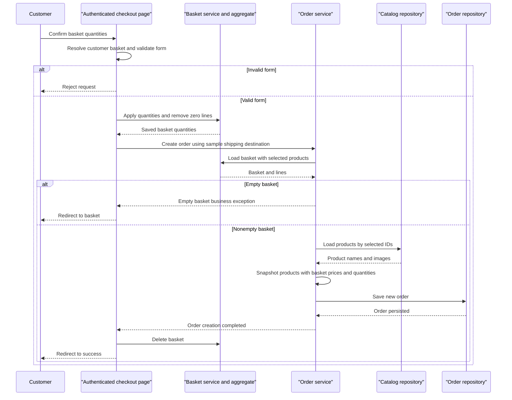

# Core Business Workflows

Users browse products, build a basket, sign in and create an order; administrators maintain the catalog (`src/Web/Pages/Basket/Index.cshtml.cs:28-65`, `src/Web/Pages/Basket/Checkout.cshtml.cs:44-67`, `src/PublicApi/CatalogItemEndpoints/CreateCatalogItemEndpoint.cs:27-74`). The implemented checkout is a sample order-creation flow, not evidence of payment capture, stock reservation or fulfillment.

## Domain Entities

| Entity | Service / Bounded Context | Description | Key Relationships |
|---|---|---|---|
| CatalogItem | Shared commerce / catalog | Product offered for sale | Classified by CatalogBrand and CatalogType (`src/ApplicationCore/Entities/CatalogItem.cs:7-30`) |
| CatalogBrand / CatalogType | Shared commerce / catalog | Product brand and type lookups | Referred to by catalog products (`src/ApplicationCore/Entities/CatalogBrand.cs:5-11`, `src/ApplicationCore/Entities/CatalogType.cs:5-11`) |
| Basket / BasketItem | Shared commerce / shopping | Shopper selection and quantities | Basket owns lines with logical product references (`src/ApplicationCore/Entities/BasketAggregate/Basket.cs:8-35`) |
| Order / OrderItem | Shared commerce / ordering | Recorded purchase selection and total | Order owns order lines, shipping address and item snapshots (`src/ApplicationCore/Entities/OrderAggregate/Order.cs:13-45`) |
| Address / CatalogItemOrdered | Ordering value objects | Shipping destination and product description at order time | Owned by order/order line; product snapshot does not change when catalog changes (`src/ApplicationCore/Entities/OrderAggregate/CatalogItemOrdered.cs:5-19`, `src/ApplicationCore/Entities/OrderAggregate/Address.cs:3-25`) |
| ApplicationUser / roles | Identity | Accounts and administrator permissions | Shared Identity model and role membership (`src/Infrastructure/Identity/ApplicationUser.cs:5-7`, `src/Infrastructure/Identity/AppIdentityDbContextSeed.cs:18-29`) |
| Buyer / PaymentMethod | Buyer scaffolding | Buyer identity and payment metadata declarations | Collection exists in domain, but no active payment workflow/mapping established (`src/ApplicationCore/Entities/BuyerAggregate/Buyer.cs:7-22`, `src/ApplicationCore/Entities/BuyerAggregate/PaymentMethod.cs:3-8`, `src/Infrastructure/Data/CatalogContext.cs:14-25`) |

## Service-to-Domain Mapping

| Service | Domain Context | Owned Entities | External Dependencies |
|---|---|---|---|
| Web | Storefront, basket and ordering; account UI | Uses shared commerce and Identity models rather than isolated ownership | Shared repositories, Identity managers; PublicApi for admin bridge/client and health checks (`src/Web/Configuration/ConfigureCoreServices.cs:15-25`, `src/Web/Program.cs:55-112`) |
| PublicApi | Catalog administration/browsing and sign-in | CatalogItem, CatalogBrand, CatalogType through shared Infrastructure; shared user model | Shared EF repositories and Identity (`src/PublicApi/Program.cs:34-46`, `src/PublicApi/CatalogItemEndpoints/CreateCatalogItemEndpoint.cs:18-51`) |
| ApplicationCore / Infrastructure | Shared domain rules and persistence | Basket/order/catalog aggregates; Identity in Infrastructure | In-process interfaces/implementations, not separate network services (`src/Infrastructure/Infrastructure.csproj:16`, `src/ApplicationCore/Interfaces/IRepository.cs:5-7`) |
| BlazorAdmin | Administration client | Client contracts only; server remains source of truth | Web user-state bridge and PublicApi HTTP (`src/BlazorAdmin/CustomAuthStateProvider.cs:50-84`, `src/BlazorAdmin/Services/HttpService.cs:18-81`) |

These are logical context/module boundaries, not independently deployed business bounded-context services. Store details are in `data-architecture.md`.

## Primary Workflows

### Workflow 1: Browse and maintain a basket

1. Catalog read-model services use filtered specifications and generate product/view-model data; cached results reduce repeated browsing work (`src/Web/Services/CatalogViewModelService.cs:28-89`, `src/Web/Configuration/ConfigureWebServices.cs:13-17`).
2. Basket page chooses the signed-in username or a GUID-based anonymous cookie. Missing/invalid product IDs redirect to browsing rather than adding a line (`src/Web/Pages/Basket/Index.cshtml.cs:33-48,68-98`).
3. It fetches the authoritative product to obtain the price, then BasketService finds/creates the user's basket and invokes the **Basket line merge** rule before persistence (`src/Web/Pages/Basket/Index.cshtml.cs:40-48`, `src/ApplicationCore/Services/BasketService.cs:23-37`).
4. Quantity-update forms require valid ModelState; **Basket quantity bounds** and **Zero-line removal** rules apply during mutation, then the view model is remapped (`src/Web/Pages/Basket/Index.cshtml.cs:55-65`, `src/ApplicationCore/Services/BasketService.cs:47-63`).

### Workflow 2: Sign in and transfer an anonymous basket

1. Login model validates the sign-in form using **Login input validation** and calls Identity sign-in with lockoutOnFailure true (`src/Web/Areas/Identity/Pages/Account/Login.cshtml.cs:37-48,68-78`).
2. On success it logs sign-in, transfers an anonymous basket when a parseable GUID cookie is present, deletes that cookie and returns a local redirect. Two-factor and lockout results have separate redirects; invalid credentials redisplay an error (`src/Web/Areas/Identity/Pages/Account/Login.cshtml.cs:80-117`).
3. BasketService looks up anonymous and account baskets; if no anonymous basket exists it returns. It creates an account basket if needed, merges every line via the aggregate, saves the account basket and deletes the anonymous one (`src/ApplicationCore/Services/BasketService.cs:66-84`).

This transfer is in-process commerce/identity orchestration, not a queue/event flow.

### Workflow 3: Checkout and record an order

1. Authenticated customer submits `/Basket/Checkout`; the page resolves the current basket and checks ModelState, returning 400 for invalid input (`src/Web/Pages/Basket/Checkout.cshtml.cs:14,44-56,70-81`).
2. Quantities are updated first. OrderService then reloads the basket with lines and applies the **Nonempty checkout** guard (`src/Web/Pages/Basket/Checkout.cshtml.cs:55-57`, `src/ApplicationCore/Services/OrderService.cs:30-36`).
3. Products are fetched in a batch. Each basket line becomes an order line with current product name/image but **basket-captured unit price and quantity**; the item snapshot preserves product details (`src/ApplicationCore/Services/OrderService.cs:38-47`, `src/ApplicationCore/Entities/OrderAggregate/CatalogItemOrdered.cs:5-19`).
4. The sample page supplies a fixed shipping Address instead of collecting a checkout address; no address value is reproduced here. The order is persisted, then the basket is deleted, then success is shown (`src/Web/Pages/Basket/Checkout.cshtml.cs:57-67`, `src/ApplicationCore/Services/OrderService.cs:49-51`).
5. Empty basket exceptions are logged and redirect to the basket; other errors have no checkout-specific compensation branch (`src/Web/Pages/Basket/Checkout.cshtml.cs:60-67`).

No payment-provider call, payment status, inventory adjustment or shipping state transition occurs in this implementation (`src/ApplicationCore/Services/OrderService.cs:30-51`). Order save and basket deletion are separate operations, not an explicit transactional unit.

### Workflow 4: Administrator creates or updates a product

1. Blazor authentication state fetches Web user info and attaches a bearer token. PublicApi writes require administrator-role bearer authorization (`src/BlazorAdmin/CustomAuthStateProvider.cs:50-84`, `src/PublicApi/CatalogItemEndpoints/CreateCatalogItemEndpoint.cs:29-35`).
2. Create applies **Catalog name existence check**; a duplicate raises DuplicateException and becomes a conflict response. New products are saved then assigned a placeholder image; the disabled upload path does not establish real image ingestion (`src/PublicApi/CatalogItemEndpoints/CreateCatalogItemEndpoint.cs:43-74`, `src/PublicApi/Middleware/ExceptionMiddleware.cs:35-42`).
3. Update looks up the product, returns not-found if missing, and applies **Catalog detail update guards**, **Brand/type ID guards**, and placeholder-image update before saving (`src/PublicApi/CatalogItemEndpoints/UpdateCatalogItemEndpoint.cs:37-65`, `src/ApplicationCore/Entities/CatalogItem.cs:33-64`).
4. Admin client mutations refresh the local product list; failures may show toasts/null results rather than a retry or compensating write (`src/BlazorAdmin/Services/CachedCatalogItemServiceDecorator.cs:80-111`, `src/BlazorAdmin/Services/HttpService.cs:49-81`).

### Other Workflows

Order history is queried via buyer-filtered specifications; detail is queried by order ID and projected to a view model (`src/ApplicationCore/Specifications/CustomerOrdersSpecification.cs:8-11`, `src/Web/Features/OrderDetails/GetOrderDetailsHandler.cs:18-43`). Account management supports password changes, email verification and two-factor/recovery-code operations (`src/Web/Controllers/ManageController.cs:106-231,318-500`).

Startup initializes catalog lookup/product data and sample Identity accounts/role. This is sample business bootstrap, not a scheduled job (`src/Infrastructure/Data/CatalogContextSeed.cs:24-45`, `src/Infrastructure/Identity/AppIdentityDbContextSeed.cs:18-29`). Sample passwords are intentionally omitted.

## Cross-Service Data Flows

The browser admin combines catalog items with brand/type lookup data at the client/service-contract boundary, while both server hosts use shared models/persistence; no API gateway multi-backend composition is implemented in the reviewed hosts (`src/BlazorAdmin/Services/CatalogItemService.cs:26-90`, `src/PublicApi/Program.cs:34-46`, `src/Web/Configuration/ConfigureCoreServices.cs:15-25`). The Web cookie identity → UserInfo/token → PublicApi administrator-write chain is the main inter-host interaction (`src/Web/Controllers/UserController.cs:60-103`, `src/BlazorAdmin/CustomAuthStateProvider.cs:57-82`).

Checkout joins basket product IDs to catalog records **within the shared application** and stores snapshots; it does not ask another service for products or publish an order event (`src/ApplicationCore/Services/OrderService.cs:32-51`). No circuit-breaker business fallback exists. Admin HTTP failures return null and/or show a toast; identity fetch failure falls back to anonymous, not stale authenticated access (`src/BlazorAdmin/Services/HttpService.cs:25-81`, `src/BlazorAdmin/CustomAuthStateProvider.cs:54-66`).

## Business Workflow Sequence

Sequence evidence: `src/Web/Pages/Basket/Checkout.cshtml.cs:44-67`, `src/ApplicationCore/Services/OrderService.cs:30-51`, `src/ApplicationCore/Services/BasketService.cs:40-63`. The alt paths are actual business branches, not invented circuit-breaker behavior.

## Business Rules & Decision Logic

| Rule | Implemented decision / constraint | Evidence |
|---|---|---|
| Basket line merge | Product already in basket adds quantity to existing line instead of adding duplicate product line | `src/ApplicationCore/Entities/BasketAggregate/Basket.cs:22-30` |
| Basket quantity bounds / zero-line removal | Added or assigned quantity is checked within 0..int.MaxValue; zero-quantity lines removed after update. No stock-capacity check is implemented here | `src/ApplicationCore/Entities/BasketAggregate/BasketItem.cs:20-31`, `src/ApplicationCore/Entities/BasketAggregate/Basket.cs:33-35` |
| Nonempty checkout | Missing basket rejected; empty basket rejected via custom EmptyBasketOnCheckout guard/exception | `src/ApplicationCore/Services/OrderService.cs:32-36`, `src/ApplicationCore/Extensions/GuardExtensions.cs:8-15` |
| Order snapshot / total | Snapshot product ID/name/image; retain basket unit price; total is sum of UnitPrice × Units. No tax, discount, freight or currency conversion logic in total | `src/ApplicationCore/Services/OrderService.cs:41-49`, `src/ApplicationCore/Entities/OrderAggregate/Order.cs:38-45` |
| Order buyer and snapshot guards | Order buyer nonempty; snapshot product ID at least 1 and name/image nonempty | `src/ApplicationCore/Entities/OrderAggregate/Order.cs:13-19`, `src/ApplicationCore/Entities/OrderAggregate/CatalogItemOrdered.cs:11-19` |
| Catalog detail update guards | Name/description nonempty; price positive; type/brand IDs nonzero. Constructor/create does not invoke the UpdateDetails guards | `src/ApplicationCore/Entities/CatalogItem.cs:18-53`, `src/PublicApi/CatalogItemEndpoints/CreateCatalogItemEndpoint.cs:50` |
| Catalog name existence check | Count matching names before create; duplicate exception yields conflict. Application-level check does not establish database uniqueness or update uniqueness | `src/PublicApi/CatalogItemEndpoints/CreateCatalogItemEndpoint.cs:43-48`, `src/Infrastructure/Data/Config/CatalogItemConfiguration.cs:11-34` |
| Admin client validation | Name/description required; price 0.01..1000 with positive/two-decimal regex; client image helper checks nonempty bytes, max 512000 and jpg/png/gif/jpeg extension. These helpers are not evidence of active server upload validation | `src/BlazorShared/Models/CatalogItem.cs:19-60,78-85`, `src/PublicApi/CatalogItemEndpoints/CreateCatalogItemEndpoint.cs:53-60` |
| Login input validation | Required email with email format and required password; lockoutOnFailure true in actual call despite preceding sample comment | `src/Web/Areas/Identity/Pages/Account/Login.cshtml.cs:37-48,74-78` |
| Authorization | Checkout/orders require authenticated users; admin page and catalog mutations require administrator role. Detail request carries username but handler queries by order ID only; per-buyer detail enforcement is not established | `src/Web/Pages/Basket/Checkout.cshtml.cs:14`, `src/Web/Pages/Admin/Index.cshtml.cs:12`, `src/PublicApi/CatalogItemEndpoints/CreateCatalogItemEndpoint.cs:30`, `src/Web/Features/OrderDetails/GetOrderDetailsHandler.cs:18-43` |

**Transactions and consistency:** no explicit transaction spans quantity update → order save → basket deletion, or account-basket update → anonymous-basket deletion; failures can leave earlier operations persisted. No saga/compensation/outbox is established in these implementations (`src/Web/Pages/Basket/Checkout.cshtml.cs:55-58`, `src/ApplicationCore/Services/BasketService.cs:78-83`).

**Error handling and audit:** empty checkout logs a warning; quantity changes and login are logged; API duplicate exceptions become conflicts and other exceptions become generic internal-server-error responses with ErrorDetails. These are logs, not a durable business audit stream (`src/Web/Pages/Basket/Checkout.cshtml.cs:60-64`, `src/ApplicationCore/Services/BasketService.cs:57`, `src/Web/Areas/Identity/Pages/Account/Login.cshtml.cs:82,92`, `src/PublicApi/Middleware/ExceptionMiddleware.cs:35-51`).

**State model:** the Order aggregate has creation date, lines/address and total but no explicit Created/Confirmed/Shipped/Delivered state machine; Basket deletion is the implemented post-order cleanup (`src/ApplicationCore/Entities/OrderAggregate/Order.cs:13-45`, `src/Web/Pages/Basket/Checkout.cshtml.cs:58`). PaymentMethod's comment requires actual card data to live in a PCI-compliant external system, but no such integration is implemented in the examined order flow (`src/ApplicationCore/Entities/BuyerAggregate/PaymentMethod.cs:6`, `src/ApplicationCore/Services/OrderService.cs:30-51`).

Limitations: source-derived workflows only; no application execution, payment/identity integration tests, or business correctness certification. External account/email capabilities cannot be assumed from UI alone; the repository EmailSender adapter is a stub (`src/Infrastructure/Services/EmailSender.cs:8-13`).
