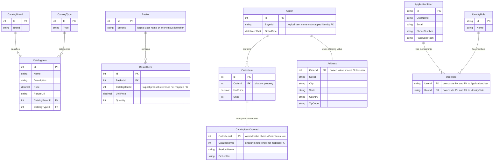

# Data Architecture & Persistence Layer

CatalogContext exposes seven persisted commerce entity sets; AppIdentityDbContext supplies the Identity model, while Address and CatalogItemOrdered are owned value objects (`src/Infrastructure/Data/CatalogContext.cs:14-25`, `src/Infrastructure/Identity/AppIdentityDbContext.cs:7-19`, `src/Infrastructure/Data/Config/OrderConfiguration.cs:19-43`, `src/Infrastructure/Data/Config/OrderItemConfiguration.cs:11-18`). EF Core SQL Server and optional in-memory providers are declared at 8.0.2 (`Directory.Packages.props:7,39-40`).

## Database Configuration

| Service/Module | DB Type | Profile | Driver | Connection | Migration Tool |
|---|---|---|---|---|---|
| Web and PublicApi catalog/identity contexts | SQL Server LocalDB | Development/default JSON | EF Core SqlServer 8.0.2 | Integrated security; separate catalog and identity database names (`src/Web/appsettings.json:6-9`, `src/PublicApi/appsettings.json:6-9`) | EF migrations applied at seed time for SQL provider (`src/Infrastructure/Data/CatalogContextSeed.cs:15-22`, `src/Infrastructure/Identity/AppIdentityDbContextSeed.cs:11-16`) |
| Both hosts | SQL Server-compatible Azure SQL Edge container | Docker | EF Core SqlServer | Shared SQL server, port 1433; credential-bearing strings omitted here (`src/Web/appsettings.Docker.json:2-5`, `src/PublicApi/appsettings.Docker.json:2-5`, `docker-compose.yml:18-24`) | Same EF migration trees |
| Web | Azure SQL | Non-Development/non-Docker branch; Azure provisioning | EF Core SqlServer, retry enabled | Connection strings loaded from Key Vault-selected names; two SQL modules/databases (`src/Web/Program.cs:29-42`, `infra/main.bicep:76-105`) | EF seed migration plus infrastructure user-provisioning script (`infra/core/database/sqlserver/sqlserver.bicep:45-95`) |
| PublicApi | SQL Server by configuration | All environments unless in-memory flag | EF Core SqlServer | Uses shared Dependencies registration; no Web-style Key Vault loader in API entry point (`src/PublicApi/Program.cs:34`, `src/Infrastructure/Dependencies.cs:27-37`) | EF seed migrations |
| Both contexts, where shared registration is used | Volatile EF InMemory | Explicit boolean switch; API integration test config | EF Core InMemory 8.0.2 | Named Catalog and Identity stores; not relational SQL and not durable (`src/Infrastructure/Dependencies.cs:13-25`, `tests/PublicApiIntegrationTests/appsettings.test.json:1-3`) | SQL migrations skipped by SqlServer provider guards in seed routines |

No custom pooling limits are set in the reviewed context configuration (`src/Infrastructure/Dependencies.cs:19-37`, `src/Web/Program.cs:33-42`). Catalog seed creates brands/types/items only when those sets are empty; Identity seed creates sample users and an administrator role (`src/Infrastructure/Data/CatalogContextSeed.cs:25-50`, `src/Infrastructure/Identity/AppIdentityDbContextSeed.cs:18-29`). Secret values are excluded. Property-level inventory belongs to `configuration-inventory.md`.

## Data Ownership per Service

| Service | Tables Owned | ORM Framework | Caching | Notes |
|---|---|---|---|---|
| Shared Infrastructure commerce context, used by Web and PublicApi | Catalog, CatalogBrands, CatalogTypes, Baskets, BasketItems, Orders, OrderItems | EF Core | Web read-model cache; admin client cache | Logical model ownership is in shared Infrastructure, not service-isolated schemas (`src/Infrastructure/Data/CatalogContext.cs:14-25`, `src/Infrastructure/Data/Config/CatalogItemConfiguration.cs:11`, `src/Web/Configuration/ConfigureWebServices.cs:13-17`) |
| Shared Infrastructure identity context, used by both hosts | AspNetUsers, AspNetRoles, AspNetUserClaims, AspNetRoleClaims, AspNetUserLogins, AspNetUserRoles, AspNetUserTokens | Identity EF Core | Web cookie-revocation markers | Framework tables confirmed by migration (`src/Infrastructure/Identity/AppIdentityDbContext.cs:7-19`, `src/Infrastructure/Identity/Migrations/20201202111612_InitialIdentityModel.cs:10-205`, `src/Web/Controllers/UserController.cs:49-54`) |
| BlazorAdmin | No server tables | None; HTTP contracts | Browser local storage | Client-side models are not EF ownership (`src/BlazorAdmin/Program.cs:23-34`, `src/BlazorAdmin/Services/HttpService.cs:18-34`) |
| Buyer / PaymentMethod declarations | Not mapped by current CatalogContext | No active mapping established | None established | Domain scaffolding, not confirmed persisted tables (`src/ApplicationCore/Entities/BuyerAggregate/Buyer.cs:7-22`, `src/ApplicationCore/Entities/BuyerAggregate/PaymentMethod.cs:3-8`, `src/Infrastructure/Data/CatalogContext.cs:14-25`) |

## Entity Model

Address/CatalogItemOrdered boxes describe owned values, not standalone tables; UserRole is the representative Identity join table. There is deliberately **no FK arrow** from BasketItem/CatalogItemOrdered to CatalogItem, or from BuyerId to ApplicationUser: the migration defines scalar references but no such constraints (`src/Infrastructure/Data/Migrations/20201202111507_InitialModel.cs:79-98,129-156`, `src/Infrastructure/Data/Config/OrderConfiguration.cs:19-43`, `src/Infrastructure/Data/Config/OrderItemConfiguration.cs:11-18`). Diagram relationship evidence: catalog brand/type FKs (`src/Infrastructure/Data/Config/CatalogItemConfiguration.cs:28-34`); basket/order children and Identity memberships (`src/Infrastructure/Data/Migrations/20201202111507_InitialModel.cs:79-98,129-156`, `src/Infrastructure/Identity/Migrations/20201202111612_InitialIdentityModel.cs:130-160`).

| Model and source | Fields/types and persistence constraints |
|---|---|
| CatalogItem (`src/ApplicationCore/Entities/CatalogItem.cs:7-16`) | BaseEntity integer Id; Name/Description/PictureUri strings; Price decimal; brand/type integer IDs and navigations. Catalog table, HiLo ID, required Name max 50, Price decimal(18,2), optional picture (`src/ApplicationCore/Entities/BaseEntity.cs:3-6`, `src/Infrastructure/Data/Config/CatalogItemConfiguration.cs:11-34`) |
| CatalogBrand / CatalogType (`src/ApplicationCore/Entities/CatalogBrand.cs:5-11`, `src/ApplicationCore/Entities/CatalogType.cs:5-11`) | Integer Id; Brand/Type strings required max 100; HiLo sequences (`src/Infrastructure/Data/Config/CatalogBrandConfiguration.cs:11-19`, `src/Infrastructure/Data/Config/CatalogTypeConfiguration.cs:11-19`) |
| Basket / BasketItem (`src/ApplicationCore/Entities/BasketAggregate/Basket.cs:8-14`, `src/ApplicationCore/Entities/BasketAggregate/BasketItem.cs:5-17`) | BuyerId string required max 256; readonly Items projection; item integer IDs, Quantity, decimal UnitPrice; child collection uses field access and price decimal(18,2) (`src/Infrastructure/Data/Config/BasketConfiguration.cs:11-16`, `src/Infrastructure/Data/Config/BasketItemConfiguration.cs:11-13`) |
| Order / OrderItem (`src/ApplicationCore/Entities/OrderAggregate/Order.cs:8-36`, `src/ApplicationCore/Entities/OrderAggregate/OrderItem.cs:3-17`) | BuyerId string, DateTimeOffset order date, owned Address, readonly child collection; order item owned snapshot, decimal UnitPrice and integer Units. Buyer max 256; price decimal(18,2) (`src/Infrastructure/Data/Config/OrderConfiguration.cs:11-43`, `src/Infrastructure/Data/Config/OrderItemConfiguration.cs:11-22`) |
| Address (`src/ApplicationCore/Entities/OrderAggregate/Address.cs:3-25`) | Street, City, State, Country, ZipCode strings; owned required navigation; maximum lengths 180/100/60/90/18 respectively; State not marked required (`src/Infrastructure/Data/Config/OrderConfiguration.cs:19-43`) |
| CatalogItemOrdered (`src/ApplicationCore/Entities/OrderAggregate/CatalogItemOrdered.cs:9-27`) | CatalogItemId integer, ProductName/PictureUri strings; owned snapshot; ProductName required max 50 (`src/Infrastructure/Data/Config/OrderItemConfiguration.cs:11-18`) |
| ApplicationUser (`src/Infrastructure/Identity/ApplicationUser.cs:5-7`) | Inherits IdentityUser; migration includes username/email/phone/password hash, confirmation flags, stamps, lockout fields; framework Identity relationships (`src/Infrastructure/Identity/Migrations/20201202111612_InitialIdentityModel.cs:26-59`) |
| Unmapped Buyer / PaymentMethod (`src/ApplicationCore/Entities/BuyerAggregate/Buyer.cs:7-22`, `src/ApplicationCore/Entities/BuyerAggregate/PaymentMethod.cs:3-8`) | Buyer has IdentityGuid and payment collection; PaymentMethod has Alias/CardId/Last4 nullable strings. Not included in persisted diagram because active context does not map them. |

Collections are encapsulated and loaded explicitly through Include specifications, not demonstrated lazy-loading proxies (`src/ApplicationCore/Specifications/BasketWithItemsSpecification.cs:8-19`, `src/ApplicationCore/Specifications/OrderWithItemsByIdSpec.cs:8-13`). Initial migration configures cascade deletion of basket/order children and catalog lookup relationships (`src/Infrastructure/Data/Migrations/20201202111507_InitialModel.cs:92-97,115-126,148-155`). No explicit multi-operation transaction is present in checkout/order orchestration; SQL-provider EF operations have their own save behavior, but a workflow-spanning transaction is not established (`src/Web/Pages/Basket/Checkout.cshtml.cs:55-58`, `src/ApplicationCore/Services/OrderService.cs:30-51`).

## Key Repository Methods

| Service | Repository | Notable Methods | Purpose |
|---|---|---|---|
| Both hosts | IRepository&lt;T&gt; / IReadRepository&lt;T&gt;, EfRepository&lt;T&gt; | No locally added CRUD signatures: interfaces inherit Ardalis repository bases; implementation is RepositoryBase&lt;T&gt; | Aggregate-constrained abstraction (`src/ApplicationCore/Interfaces/IRepository.cs:5-7`, `src/ApplicationCore/Interfaces/IReadRepository.cs:5-7`, `src/Infrastructure/Data/EfRepository.cs:6-11`) |
| Web basket/order | IRepository&lt;Basket&gt; | FirstOrDefaultAsync(BasketWithItemsSpecification(int basketId or string buyerId)) -> Basket or null | Load basket with items (`src/ApplicationCore/Specifications/BasketWithItemsSpecification.cs:6-20`, `src/ApplicationCore/Services/OrderService.cs:32-33`) |
| Checkout/read models | IRepository&lt;CatalogItem&gt; | ListAsync(CatalogItemsSpecification(params int[] ids)) -> list of CatalogItem | Bulk product lookup with IDs.Contains; in-process composition, not cross-service bulk API (`src/ApplicationCore/Specifications/CatalogItemsSpecification.cs:8-12`, `src/ApplicationCore/Services/OrderService.cs:38-39`) |
| PublicApi | IRepository&lt;CatalogItem&gt; | CountAsync(CatalogFilterSpecification); ListAsync(CatalogFilterPaginatedSpecification) | Filtered count and paging (`src/PublicApi/CatalogItemEndpoints/CatalogItemListPagedEndpoint.cs:45-54`) |
| PublicApi create | IRepository&lt;CatalogItem&gt; | CountAsync(CatalogItemNameSpecification(string name)) -> int | Name-existence lookup (`src/PublicApi/CatalogItemEndpoints/CreateCatalogItemEndpoint.cs:43-47`) |
| Web orders | IReadRepository&lt;Order&gt; | FirstOrDefaultAsync(OrderWithItemsByIdSpec(int orderId), CancellationToken); buyer-filtered customer specifications | Detail item projection and customer order lists (`src/Web/Features/OrderDetails/GetOrderDetailsHandler.cs:18-43`, `src/ApplicationCore/Specifications/CustomerOrdersSpecification.cs:8-11`) |
| Web basket summary | IBasketQueryService / BasketQueryService | CountTotalBasketItems(string username) -> Task&lt;int&gt; | Server-side LINQ SumAsync over matching items (`src/Infrastructure/Data/Queries/BasketQueryService.cs:18-27`) |

These are observed call signatures/purposes; inherited package API catalogs were not resolved. No raw SQL/stored-procedure application repository is shown by the reviewed implementations; infrastructure SQL for account provisioning is separate (`infra/core/database/sqlserver/sqlserver.bicep:81-95`).

## Caching Strategy

| Layer | Provider/pattern | Lifetime and invalidation | Evidence |
|---|---|---|---|
| Web catalog read models/lookups | IMemoryCache decorator; cache-aside GetOrCreateAsync | 30-second **sliding** expiration; catalog key includes page, page size, brand/type; brands/types separate keys; no explicit invalidation in decorator | `src/Web/Services/CachedCatalogViewModelService.cs:22-49`, `src/Web/Extensions/CacheHelpers.cs:7-23` |
| Blazor lookup lists | Blazored.LocalStorage cache-aside | One minute from creation; removes expired entry; startup removes brand/type keys | `src/BlazorAdmin/Services/CachedCatalogLookupDataServiceDecorator .cs:29-50`, `src/BlazorAdmin/Program.cs:38-49` |
| Blazor catalog item lists | LocalStorage decorator | One-minute freshness, both full/paged lists use the literal `items` key; CRUD reloads local list; browser cache is not shared across hosts | `src/BlazorAdmin/Services/CachedCatalogItemServiceDecorator.cs:27-111` |
| Web logout markers | IMemoryCache | Absolute expiry tied to 60-minute cookie validity; local host state | `src/Web/Controllers/UserController.cs:49-54`, `src/Web/Configuration/ConfigureCookieSettings.cs:10,22-26`, `src/Web/Configuration/RevokeAuthenticationEvents.cs:11-34` |
| Admin identity state | In-process cached ClaimsPrincipal | 60-second refresh interval | `src/BlazorAdmin/CustomAuthStateProvider.cs:15-47` |

Catalog cache reduces repeated read-model/API loading as implied by the decorators, not a measured performance claim. PublicApi registers memory cache but catalog endpoints directly query repositories; no endpoint result cache is established (`src/PublicApi/Program.cs:52`, `src/PublicApi/CatalogItemEndpoints/CatalogItemListPagedEndpoint.cs:45-54`). No distributed-cache or ORM second-level-cache provider is registered in the reviewed hosts.

## Data Ownership Boundaries

Both server hosts directly access the same named catalog/identity stores in local/Docker settings; separation is by DbContext/database, not database-per-service (`src/Web/appsettings.json:6-9`, `src/PublicApi/appsettings.json:6-9`, `src/Infrastructure/Dependencies.cs:32-37`). Azure declares separate SQL modules for catalog and identity, but only deploys Web in azure.yaml (`infra/main.bicep:76-105`, `azure.yaml:3-8`). Admin accesses server data over HTTP and has no direct context (`src/BlazorAdmin/Services/HttpService.cs:18-34`).

Catalog IDs link basket lines and order snapshots logically; BuyerId uses usernames/anonymous IDs instead of an enforced cross-context Identity FK. Checkout combines products/basket in-process, storing a product snapshot (`src/ApplicationCore/Services/OrderService.cs:32-49`). Web separates MediatR order queries/read models from mutation services, but no separate read store/event-sourced CQRS topology is evidenced (`src/Web/Controllers/OrderController.cs:26-35`, `src/Web/Features/OrderDetails/GetOrderDetailsHandler.cs:21-43`).

### Data Classification & Sensitivity

| Entity | Sensitive Fields | Classification (PII/PHI/PCI/None) | Controls in Place |
|---|---|---|---|
| ApplicationUser | Username, email, phone; password hash and account security metadata | PII and authentication-sensitive data | Identity managers/stores; no custom field masking/encryption mapping; deployed at-rest controls not independently verified (`src/Infrastructure/Identity/Migrations/20201202111612_InitialIdentityModel.cs:26-59`, `src/Web/Program.cs:55-58`) |
| Order / Address | BuyerId, shipping street/city/state/country/postal code | PII | Authenticated order controller; no field masking/encryption in mappings; detail handler reads by ID without checking buyer equality, so ownership enforcement must not be assumed (`src/ApplicationCore/Entities/OrderAggregate/Address.cs:5-13`, `src/Web/Features/OrderDetails/GetOrderDetailsHandler.cs:21-43`) |
| Basket | BuyerId (user name or anonymous identifier) | PII/pseudonymous identifier | User/cookie-based lookup; no field-level encryption/masking configured (`src/Web/Pages/Basket/Index.cshtml.cs:68-98`, `src/Infrastructure/Data/Config/BasketConfiguration.cs:14-16`) |
| PaymentMethod (unmapped) | CardId, Last4, Alias | Payment-related metadata, not demonstrated full card storage | Source explicitly says actual card data belongs in a PCI-compliant system; no processor integration or persisted table established (`src/ApplicationCore/Entities/BuyerAggregate/PaymentMethod.cs:3-8`) |
| Catalog entities | Product names, descriptions, price, image/lookup data | None evident | Ordinary commerce data (`src/ApplicationCore/Entities/CatalogItem.cs:9-16`) |

No PHI entity fields were identified in this commerce model. No repository-level encryption-at-rest, masking policy or custom field-level access controls are configured in the reviewed EF mappings; that does not establish whether the deployed SQL platform applies encryption outside this repository. This document inventories controls and sensitivity, not compliance certification.
