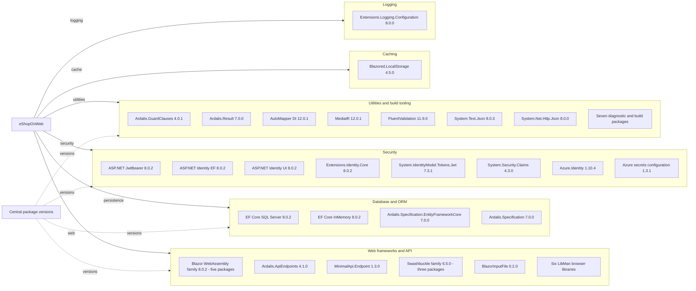

# Dependency Map

eShopOnWeb declares 39 distinct production-project NuGet packages, six LibMan browser libraries and ten additional test-only NuGet packages: 55 distinct external declarations across these manifests. Shared package references count once; centrally listed but unreferenced `Microsoft.AspNetCore.Mvc` is excluded (`src/*/*.csproj`, `tests/*/*.csproj`, `Directory.Packages.props:11-70`, `src/Web/libman.json:4-44`).

## Dependencies

All NuGet versions above come from `Directory.Packages.props:5-55`; actual inclusion comes from the project references, not the central catalog alone. Diagram aggregates small build/tooling packages and browser libraries to remain below 40 nodes.

### Dependency Summary

| Category | Count | Key Libraries | Notes |
|---|---:|---|---|
| Web frameworks/API/browser | 17 | Components.Authorization, WebAssembly, WebAssembly.Authentication, WebAssembly.DevServer, WebAssembly.Server **8.0.2**; Ardalis.ApiEndpoints **4.1.0**; MinimalApi.Endpoint **1.3.0**; Swashbuckle.AspNetCore, SwaggerUI, Annotations **6.5.0**; BlazorInputFile **0.2.0**; jQuery **3.6.3**, Bootstrap **3.4.1**, jquery-validation-unobtrusive **4.0.0**, jquery-validate **1.19.5**, toastr.js **2.1.4**, aspnet-signalr **1.0.27** | Count = eleven NuGet plus six LibMan entries (`src/BlazorAdmin/BlazorAdmin.csproj:3-11`, `src/PublicApi/PublicApi.csproj:12-17`, `src/Web/Web.csproj:23`, `src/BlazorShared/BlazorShared.csproj:9`, `src/Web/libman.json:6-38`) |
| Database/ORM | 4 | EFCore.SqlServer, EFCore.InMemory **8.0.2**; Ardalis.Specification, Specification.EntityFrameworkCore **7.0.0** | EF Tools counted as tooling, Identity EF as security (`src/Infrastructure/Infrastructure.csproj:9-12`, `src/ApplicationCore/ApplicationCore.csproj:11`) |
| Security | 8 | JwtBearer, Identity.EntityFrameworkCore, Identity.UI, Extensions.Identity.Core **8.0.2**; System.IdentityModel.Tokens.Jwt **7.3.1**; System.Security.Claims **4.3.0**; Azure.Identity **1.10.4**; Azure.Extensions.AspNetCore.Configuration.Secrets **1.3.1** | Auth and cloud credentials (`src/Web/Web.csproj:19-20,28-31,36`, `src/BlazorAdmin/BlazorAdmin.csproj:9`, `src/ApplicationCore/ApplicationCore.csproj:12`) |
| Caching | 1 | Blazored.LocalStorage **4.5.0** | Browser storage (`src/BlazorAdmin/BlazorAdmin.csproj:3`) |
| Logging | 1 | Microsoft.Extensions.Logging.Configuration **8.0.0** | Declared client logging package (`src/BlazorAdmin/BlazorAdmin.csproj:10`) |
| Utilities/build | 14 | GuardClauses **4.0.1**; Result **7.0.0**; AutoMapper DI **12.0.1**; MediatR **12.0.1**; FluentValidation **11.9.0**; System.Text.Json **8.0.3**; System.Net.Http.Json **8.0.0**; Ardalis.ListStartupServices **1.1.4**; BuildBundlerMinifier **3.2.449**; Diagnostics.EntityFrameworkCore **8.0.2**; EFCore.Tools **8.0.2**; VisualStudio.Azure.Containers.Tools.Targets **1.19.6**; VisualStudio.Web.CodeGeneration.Design **8.0.0**; Web.LibraryManager.Build **2.1.175** | Seven aggregated diagnostic/build entries plus seven individually represented utilities. Sources: `src/Web/Web.csproj:16-36`, `src/PublicApi/PublicApi.csproj:24-29`, `src/ApplicationCore/ApplicationCore.csproj:9-13`, `src/BlazorShared/BlazorShared.csproj:10`, `src/BlazorAdmin/BlazorAdmin.csproj:11` |

Counting basis: production NuGet categories are 11 + 4 + 8 + 1 + 1 + 14 = **39**; adding six browser libraries gives **45** non-test declarations. Framework shared-runtime assemblies are implicit SDK inputs and are not separately counted as packages.

### Version & Compatibility Risks

Version declarations establish a .NET 8 / EF Core 8 baseline, alongside older-generation browser and compatibility packages (Bootstrap 3.4.1, aspnet-signalr 1.0.27, Claims 4.3.0; `Directory.Packages.props:4-8,50`, `src/Web/libman.json:10,38`). Their compatibility and maintenance status require separate vendor/advisory verification; this architecture-only assessment did not resolve packages or assert current CVEs/EOL. The SDK file contains the literal `8.0.x`, while Docker uses `8.0` image tags, so exact restored SDK/image revisions cannot be derived from these declarations (`global.json:2-4`, `src/Web/Dockerfile:10,20`).

### Notable Observations

- Central package management is enabled; many versions use shared property variables (`Directory.Packages.props:3-8,25-41`). `Microsoft.AspNetCore.Mvc` 2.2.0 is centrally cataloged but not referenced in the examined projects (`Directory.Packages.props:34`, `src/Web/Web.csproj:16-36`, `src/PublicApi/PublicApi.csproj:12-31`).
- Web includes BuildBundlerMinifier only in Release; EF tools and dev-server assets are development/build dependencies rather than independently deployed services (`src/Web/Web.csproj:22,32-35`, `Directory.Packages.props:28,41-44`).
- Shared packages are deduplicated across projects. No NuGet lockfile was found under the source/test build inputs; transitive versions and restore success remain unverified.
- LibMan downloads browser libraries from cdnjs and pins individual versions; no package.json-based dependency tree was found in source (`src/Web/libman.json:2-44`).

## Test Dependencies

| Framework | Version | Notes |
|---|---|---|
| Microsoft.NET.Test.Sdk | 17.9.0 | Test runner SDK (`Directory.Packages.props:58`, `tests/UnitTests/UnitTests.csproj:12`) |
| xunit | 2.7.0 | Unit, integration, functional projects (`Directory.Packages.props:59`, `tests/IntegrationTests/IntegrationTests.csproj:16`) |
| xunit.runner.visualstudio | 2.5.6 | Runner (`Directory.Packages.props:60-63`, `tests/UnitTests/UnitTests.csproj:19`) |
| xunit.runner.console | 2.7.0 | Unit project runner (`Directory.Packages.props:64-67`, `tests/UnitTests/UnitTests.csproj:20`) |
| NSubstitute | 5.1.0 | Mocks (`Directory.Packages.props:47`, `tests/UnitTests/UnitTests.csproj:13`) |
| NSubstitute.Analyzers.CSharp | 1.0.17 | Test analyzers (`Directory.Packages.props:48`, `tests/UnitTests/UnitTests.csproj:14-17`) |
| Microsoft.AspNetCore.Mvc.Testing | 8.0.2 | Host-based functional/API integration (`Directory.Packages.props:57`, `tests/PublicApiIntegrationTests/PublicApiIntegrationTests.csproj:22`) |
| MSTest.TestAdapter | 3.2.2 | API integration adapter (`Directory.Packages.props:68`, `tests/PublicApiIntegrationTests/PublicApiIntegrationTests.csproj:24`) |
| MSTest.TestFramework | 3.2.2 | API integration assertions (`Directory.Packages.props:69`, `tests/PublicApiIntegrationTests/PublicApiIntegrationTests.csproj:25`) |
| coverlet.collector | 6.0.2 | Coverage collector (`Directory.Packages.props:70`, `tests/PublicApiIntegrationTests/PublicApiIntegrationTests.csproj:26-29`) |

Total test-only dependencies: **10 distinct packages**. EFCore.InMemory 8.0.2 is additionally referenced by test projects but also used by production projects, so is not counted again (`tests/IntegrationTests/IntegrationTests.csproj:9`, `src/Infrastructure/Infrastructure.csproj:11`). Mixed xUnit/MSTest infrastructure is declared; no tests or restoration were run for this documentation assessment.
